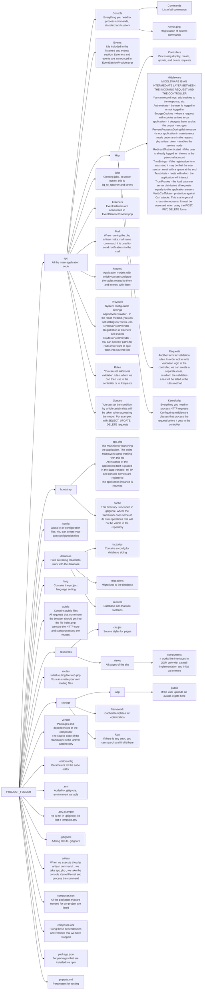

### App structure

```mermaid
graph LR
    PROJECT_FOLDER --> A[app<br>All the main application code] --> B[Console<br>Everything you need to process commands, standard and custom] --> C[Commands<br>List of all commands]
    B --> D[Kernel.php <br>Registration of custom commands]
    A --> E[Events<br>It is included in the listeners and events section. Listeners and events are announced in EventServiceProvider.php ]
    A --> H[Http] --> C1[Controllers<br>Processing display, create, update, and delete requests]
    H --> C2[Middleware<br>MIDDLEWARE IS AN INTERMEDIATE LAYER BETWEEN THE INCOMING REQUEST AND THE CONTROLLER<br>You can record logs, add cookies to the response, etc.<br>Authenticate - the user is logged in or not logged in<br>EncryptCookies - when a request with cookies arrives in our application - it decrypts them, and at the output - encrypts<br>PreventRequestsDuringMaintenance - is our application in maintenance mode under any in the request<br>php artisan down - enables the service mode<br>RedirectIfAuthenticated - if the user is already logged in - throws to the personal account<br>TrimStrings - if the registration form was sent, it may be that the user sent an email with a space at the end<br>TrustHosts - hosts with which the application will interact<br>TrustProxies - the load balancer server distributes all requests equally to the application servers<br>VerifyCsrfToken - protection against Csrf attacks. This is a forgery of cross-site requests. It must be observed when using the POST, PUT, DELETE forms]
    H --> C3[Requests<br>Another form for validation rules. In order not to write validation logic in the controller, we can create a separate class, <br> in which the validation rules will be listed in the rules method]
    H --> C4[Kernel.php<br>Everything you need to process HTTP requests<br>Configuring middleware classes that process the request before it gets to the controller]
    A --> J[Jobs<br>Creating jobs. In sxope-ocean, this is bq_to_spanner and others]
    A --> L[Listeners<br>Event listeners are announced in EventServiceProvider.php ]
    A --> M[Mail<br>When running the php artisan make:mail name command. It is used to send notifications to the mail]
    A --> M1[Models<br>Application models with which you can configure the tables related to them and interact with them]
    A --> P[Providers<br>System configurable settings<br>AppServiceProvider - In the 'boot' method, you can set settings for views, etc.<br>EventServiceProvider - Registration of listeners and events<br>RouteServiceProvider - You can set new paths for routs if we want to split them into several files]
    A --> R[Rules<br>You can set additional validation rules, which we can then use in the controller or in Requests]
    A --> S[Scopes<br>You can set the condition by which certain data will be taken when accessing the model. For example, with SELECT, UPDATE, DELETE requests]
        PROJECT_FOLDER --> B3[bootstrap] --> B4[app.php<br>The main file for launching the application. The entire framework starts working with this file<br>An instance of the application itself is placed in the $app variable, HTTP and console kernels are registered<br>The application instance is returned]
    B3 --> B5[cache<br>This directory is included in gitignore, where the framework does some of its own operations that will not be visible in the repository]
    PROJECT_FOLDER --> C5[config<br>Just a lot of configuration files. You can create your own configuration files]
    PROJECT_FOLDER --> D1[database<br>Files are being created to work with the database] --> D2[factories<br>Contains a config for database siding]
    D1 --> D3[migrations<br>Migrations to the database]
    D1 --> D4[seeders<br>Database sids that use factories]
    PROJECT_FOLDER --> L1[lang<br>Contains the project language setting]
    PROJECT_FOLDER --> P1[public<br>Contains public files<br>All requests that come from the browser should get into the file index.php <br>We take the HTTP core and start processing the request]
    PROJECT_FOLDER --> R1[resources] --> J1[css,jss<br>Source styles for pages]
    R1 --> J2[views<br>All pages of the site] --> J3[components<br>It works like interfaces in OOP, only with a small implementation and initial parameters]
    PROJECT_FOLDER --> R2[routes<br>Initial routing file web.php <br>You can create your own routing files]
    PROJECT_FOLDER --> S1[storage] --> S2[app] --> S3[public<br>If the user uploads an avatar, it gets here]
    S1 --> S4[framework<br>Cached templates for optimization]
    S1 --> S5[logs<br>If there is any error, you can search and find it there]
    PROJECT_FOLDER --> V[vendor<br>Packages and dependencies of the compositor<br>The source code of the framework in the laravel subdirectory]
    PROJECT_FOLDER --> E1[.editorconfig<br>Parameters for the code editor]
    PROJECT_FOLDER --> ENV[.env<br>Added to .gitignore, environment variable]
    PROJECT_FOLDER --> ENV1[.env.example<br>He is not in .gitignore, it's just a template.env]
    PROJECT_FOLDER --> GIT1[.gitignore<br>Adding files to .gitignore]
    PROJECT_FOLDER --> ARTISAN[artisan<br>When we execute the php artisan command... we take app.php , we take the console Kernel Kernel and process the command]
    PROJECT_FOLDER --> COMP[composer.json<br>All the packages that are needed for our project are listed]
    PROJECT_FOLDER --> COMP1[composer.lock<br>Fixing those dependencies and versions that we have stopped]
    PROJECT_FOLDER --> PACKAGE[package.json<br>For packages that are installed via npm]
    PROJECT_FOLDER --> UNIT[phpunit.xml<br>Parameters for testing]
```

A --> C(Round Rect)
B --> D{Rhombus}
C --> D
